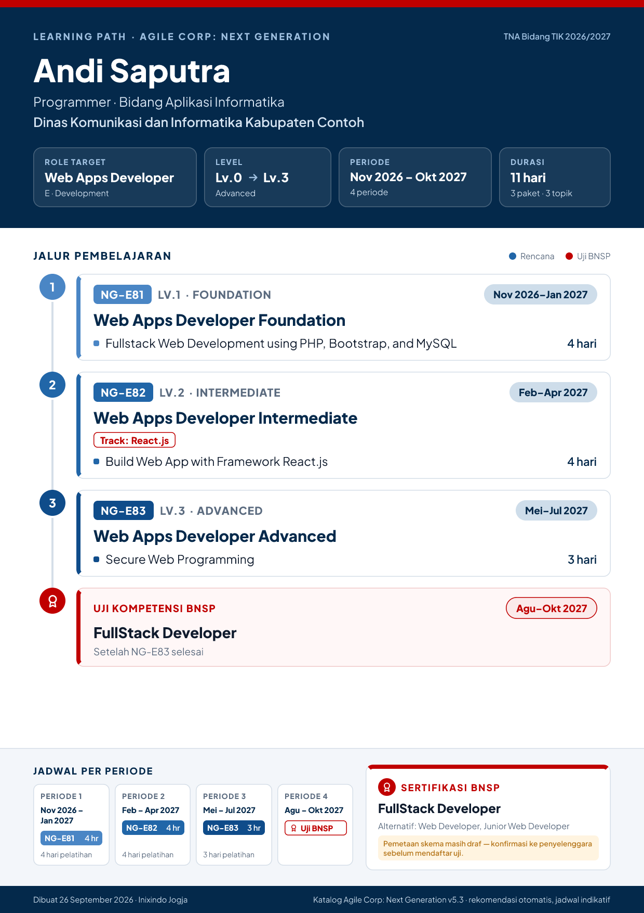
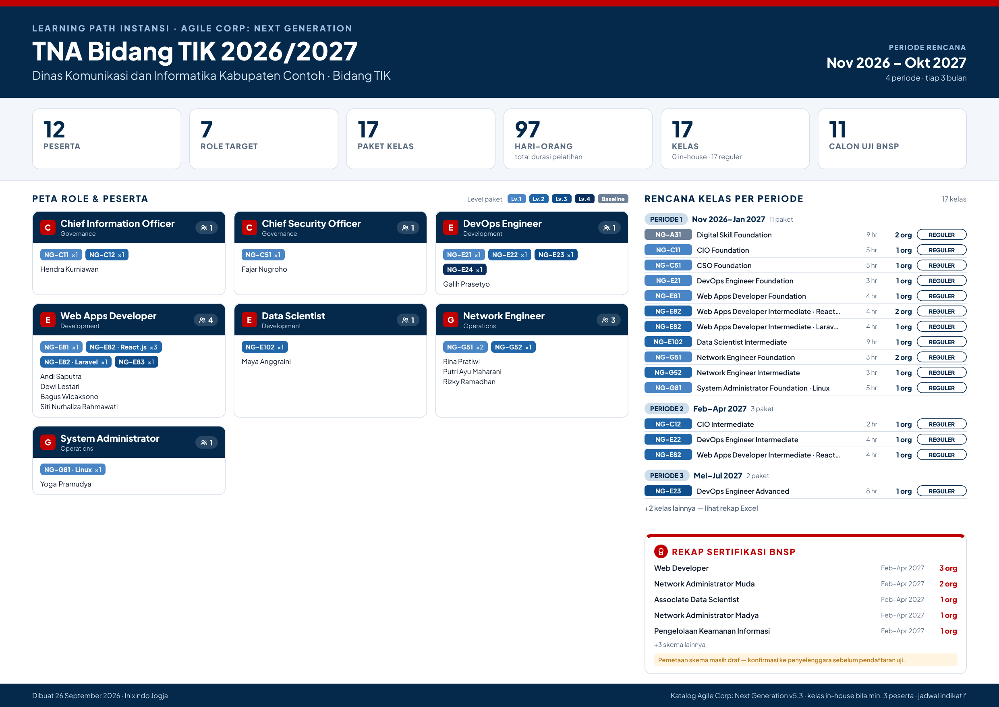

# Learning Path Generator (NG Learning Path)

Generator **learning path & rekomendasi sertifikasi BNSP** berbasis katalog **Agile Corp: Next Generation — Job Role Learning Path 2025 (v5.3)**.
Instruktur mengumpulkan data peserta (atau peserta mengisi sendiri), lalu aplikasi menghasilkan **gambar learning path per peserta** (A4 portrait) dan **poster rekap instansi** (A3 landscape) dalam format **PNG** dan **PDF**.

<p align="center">
  
  
</p>

> Semua nama pada contoh adalah fiktif. Unduh contoh dokumen rekap lengkap: [contoh-pdf-gabungan.pdf](docs/contoh/contoh-pdf-gabungan.pdf).

---

## Fitur

| Untuk | Fitur |
|---|---|
| **Instruktur** | Sesi per instansi/kelas · tambah peserta manual · impor Excel/CSV (template berdropdown atau rekap Google Form) · tebak role dari jabatan · link & QR agar peserta mengisi sendiri (mode cloud) · rekap kelas per periode (in-house/reguler) · rekap calon uji BNSP |
| **Peserta** | Isi mandiri dari HP · langsung dapat gambar learning path pribadi · bisa memperbarui isian yang sudah dikirim |
| **Output** | Gambar perorangan (PNG ±300 dpi / PDF vektor A4) · poster instansi (PNG / PDF vektor A3) · ZIP semua PNG · PDF gabungan · rekap Excel |
| **Integrasi** | API `POST /api/v1/plan` (JSON) dan `POST /api/v1/render` (PNG/SVG) dengan API key — cocok untuk n8n |
| **Katalog** | Katalog interaktif 7 fungsi · 34 role · 67 paket · 124 topik, dengan pemetaan skema BNSP (draf) |

Gambar dibuat **di browser** (satori → SVG → PNG/PDF). Data peserta tidak dikirim ke server untuk proses ini.

## Dua mode penyimpanan

| | **Mode lokal** (default) | **Mode cloud** |
|---|---|---|
| Syarat | tidak ada | Upstash Redis + `INSTRUCTOR_PASSCODE` |
| Data sesi | di browser instruktur (localStorage) | di Upstash, terhapus otomatis setelah `RETENTION_DAYS` |
| Login instruktur | tidak perlu | passcode |
| Link/QR peserta | tidak aktif (peserta pakai `/isi`, hasil hanya untuk dirinya) | aktif — isian peserta otomatis masuk ke daftar instruktur |
| Pindah perangkat | ekspor/impor JSON | otomatis |

Mode dipilih otomatis dari environment variable — tidak perlu mengubah kode.

---

## Menjalankan di komputer sendiri

Butuh **Node.js 20.9+** (disarankan 22, lihat `.nvmrc`).

```bash
npm ci
npm run dev          # http://localhost:3000
```

Mencoba mode cloud tanpa Upstash:

```bash
STORAGE_DRIVER=memory INSTRUCTOR_PASSCODE=rahasia123 npm run dev
```

Perintah lain:

```bash
npm test              # unit test (katalog, BNSP, engine, impor/ekspor, server, render)
npm run typecheck     # pemeriksaan TypeScript
npm run build         # build produksi
npm run render:samples  # render contoh gambar ke samples/out/
npm run test:e2e      # uji end-to-end di browser (jalankan setelah build)
```

> `npm run dev`/`build` otomatis menyalin `resvg.wasm` ke `public/wasm/` (mesin konversi PNG di browser).

## Repositori GitHub & Pengembangan

```bash
git clone https://github.com/aqilwahid/Learning-Path-Generator.git
cd Learning-Path-Generator
npm ci
npm run dev
```

GitHub Actions (`.github/workflows/ci.yml`) menjalankan typecheck, unit test, dan build di setiap push/PR. Uji end-to-end bisa dijalankan manual dari tab **Actions**.

## Deploy ke Vercel

1. **Import** repo di Vercel → framework terdeteksi sebagai Next.js → **Deploy**. Aplikasi langsung jalan dalam **mode lokal**.
2. (Opsional) Aktifkan **mode cloud**:
   - Vercel → **Storage / Marketplace → Upstash for Redis** → hubungkan ke project (variabel `KV_REST_API_URL` & `KV_REST_API_TOKEN` atau `UPSTASH_REDIS_REST_*` terisi otomatis).
   - Tambahkan `INSTRUCTOR_PASSCODE` dan `SESSION_SECRET` di **Settings → Environment Variables**.
   - **Redeploy**. Halaman `/instruktur` akan meminta passcode, dan tombol **Link & QR peserta** muncul.
3. (Opsional) Isi `GENERATOR_API_KEY` untuk mengaktifkan API integrasi.

Daftar lengkap variabel ada di [`.env.example`](.env.example).

---

## Cara kerja rekomendasi (ringkas)

1. **Role** — dipilih dari katalog; saat impor, role bisa ditebak dari jabatan (kamus sinonim di `data/aliases/job-titles.json`). Jabatan ambigu (mis. *Pranata Komputer*) tidak ditebak.
2. **Gap** — paket dari *level saat ini + 1* sampai *target* (default naik 1 level), dikurangi topik yang sudah diikuti.
3. **Track produk** — paket bervarian (Vue/React/Laravel/Django, Oracle/MongoDB, AWS/GCP, dll.) memakai **satu** track sesuai pilihan peserta → profil teknologi sesi → track pertama (ditandai *otomatis*).
4. **Baseline** — opsional NG-A31 Digital Skill Foundation, berjalan paralel di periode pertama.
5. **Jadwal** — per periode (default triwulan), kapasitas = maks. hari/bulan × panjang periode; default satu level per periode.
6. **Kelas** — peserta dengan paket + track + periode sama digabung; ≥ ambang peserta → *in-house*, sisanya *reguler*; dipecah bila melebihi kapasitas kelas.
7. **BNSP** — skema tertinggi yang terjangkau target menjadi rekomendasi utama; uji dijadwalkan satu periode setelah paket prasyarat selesai.

Detail: [`docs/ATURAN-ENGINE.md`](docs/ATURAN-ENGINE.md).

## Data & pembaruan

| File | Isi |
|---|---|
| `data/catalog/agile-corp-ng-2025_v5.3.json` | Katalog dari poster (divalidasi otomatis: 7/34/67/124/344 hari) |
| `data/bnsp/schemes.json` | 63 skema BNSP bersumber halaman publik Inixindo Jogja (nama, unit, durasi, URL sumber) |
| `data/bnsp/role-scheme-map.json` | **Draf** pemetaan role → skema (20 langsung, 8 parsial, 6 belum ada) — **wajib divalidasi DPPP** |
| `data/aliases/job-titles.json` | Sinonim jabatan → role untuk impor |

Panduan: [`docs/UPDATE-DATA.md`](docs/UPDATE-DATA.md) · temuan inkonsistensi poster: [`docs/TEMUAN-DATA.md`](docs/TEMUAN-DATA.md) · poster sumber: [`docs/sumber/`](docs/sumber/).

## API integrasi (n8n)

```bash
curl -X POST https://<domain>/api/v1/render \
  -H "x-api-key: $GENERATOR_API_KEY" -H "Content-Type: application/json" \
  -d '{"kind":"individual","participant":{"name":"Rina","jabatan":"Staf Jaringan","roleId":"G5","currentLevel":1}}' \
  --output learning-path.png
```

Contoh alur n8n (Google Form → gambar → Telegram) dan skema request lengkap: [`docs/INTEGRASI-N8N.md`](docs/INTEGRASI-N8N.md).

## Privasi & keamanan

- Mode lokal: data peserta hanya ada di browser instruktur/peserta.
- Mode cloud: dashboard dilindungi passcode (cookie HttpOnly bertanda tangan HMAC), isian peserta dibatasi laju (rate limit) + honeypot, halaman publik tidak menampilkan data peserta lain, data kedaluwarsa otomatis.
- Menyimpan data pribadi di layanan cloud (region Upstash) perlu diselaraskan dengan kebijakan UU PDP instansi.

## Struktur repo

```
data/                  katalog, skema BNSP, sinonim jabatan (JSON)
docs/                  arsitektur, aturan engine, temuan data, panduan update, integrasi n8n, contoh gambar
src/app/               halaman (beranda, instruktur, isi, katalog) + API route
src/components/        UI (form peserta, pratinjau gambar, dashboard instruktur)
src/lib/catalog|bnsp   pemuat data + validasi Zod
src/lib/engine/        mesin rekomendasi (gap, track, jadwal, kohort, BNSP, tebak role)
src/lib/render/        template gambar (satori) → SVG → PNG/PDF
src/lib/io/            template Excel, impor Excel/CSV, rekap Excel
src/lib/server/        konfigurasi, auth, penyimpanan (Upstash/memori), logika sesi
tests/  e2e/           unit test (Vitest) & uji end-to-end (Playwright)
```

Arsitektur lengkap: [`docs/ARSITEKTUR.md`](docs/ARSITEKTUR.md).

## Lisensi

Kode: internal/proprietary (`UNLICENSED`). Font Plus Jakarta Sans: SIL Open Font License 1.1 (`assets/fonts/OFL.txt`).
